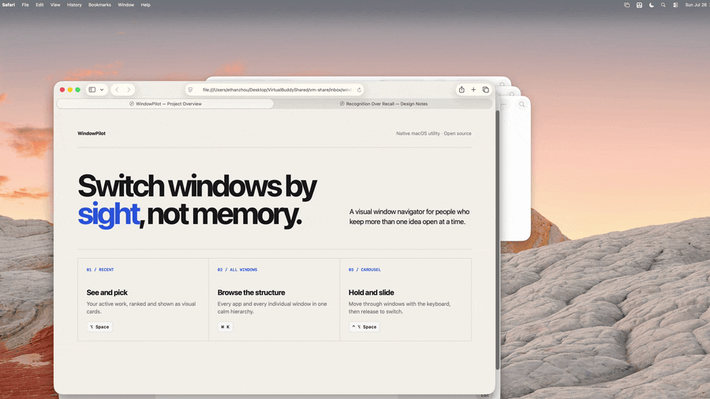

# WindowPilot

**Switch windows by sight, not memory.**

WindowPilot is a native macOS window navigator for switching individual windows—not just apps. Open a visual grid, browse every window by app, hold a shortcut to move through a carousel, or keep an optional sidebar at the edge of the screen.

[Download the latest release](https://github.com/ethannortharc/WindowPilot/releases/latest) · macOS 13+ · Free and open source



## Why WindowPilot?

`Cmd+Tab` stops at the app level. Search-based tools can reach deeper, but only after you remember enough of a window title to type it.

WindowPilot takes a recognition-first approach: show the windows themselves, then let you choose the one you recognize.

## Four ways to switch

| Mode | How to open it | Best for |
|---|---|---|
| **Recent** | Press `Option+Space` | See frequently and recently used windows as screenshot cards. Click a card or use the keyboard to switch. |
| **All Windows** | Open the navigator and select **All Windows** | Browse an App → Windows tree, filter by app or title, inspect the larger preview, then press Enter. |
| **Carousel** | Hold `Control+Option+Space` | Move through individual windows with the arrow keys and release the modifiers to switch. |
| **Sidebar** | Choose **Show Sidebar** from the menu bar icon | Keep a mouse-friendly strip of recent or pinned windows at the right edge of the screen. |

The main navigator is a non-activating AppKit panel, so the app you are working in remains active while you browse.

## Install

Download the signed and notarized DMG from [GitHub Releases](https://github.com/ethannortharc/WindowPilot/releases/latest).

On first launch, grant **Accessibility** permission in:

> System Settings → Privacy & Security → Accessibility

Accessibility is required to focus and raise windows. **Screen Recording is optional** and enables screenshot previews; WindowPilot still works with app icons and window titles when it is unavailable.

## Command-line interface

WindowPilot includes `windowpilot-cli` for scripts, terminals, launchers, and agent workflows. Install it from the menu bar icon with **Install CLI Tool…**.

```bash
# List individual windows
windowpilot-cli list

# Search and switch to the first match
windowpilot-cli switch "project overview"
windowpilot-cli "terminal"

# Return matching windows as JSON
windowpilot-cli search "safari"

# Focus an exact window or capture its screenshot
windowpilot-cli focus --id 257
windowpilot-cli capture 257 screenshot.png
```

The CLI requires Accessibility permission for switching. Its `capture` command also requires Screen Recording permission.

## Full-screen windows and Spaces

WindowPilot enumerates normal, minimized, off-Space, and full-screen windows. Normal-window switches are direct. Full-screen transitions are constrained by macOS and may include a visible native animation.

When leaving a full-screen window, WindowPilot may need to take that window out of full-screen before focusing the destination. This is an operating-system limitation rather than a hidden instant switch.

## Privacy

- Window metadata and screenshot previews are processed locally.
- Recent-window activity is session-only and is not persisted.
- Screenshot previews use a bounded in-memory cache.
- Optional Sidebar pins are stored locally in Application Support.
- Screen Recording is not required when visual previews are not needed.

## Build from source

Requirements: Swift 5.9+ and macOS 13 or later.

```bash
git clone https://github.com/ethannortharc/WindowPilot.git
cd WindowPilot
swift build
swift test
.build/debug/WindowPilot
```

For an optimized build:

```bash
swift build -c release
```

## Architecture

| Layer | Responsibility |
|---|---|
| **AppKit UI** | Non-activating navigator, Recent grid, All Windows tree, carousel, sidebar, and preferences |
| **Core Graphics** | Fast window enumeration and optional screenshot capture |
| **Accessibility APIs** | Focus, raise, minimize, and close actions |
| **WindowPilotCore** | Search, ranking, pinning, caching, snapshots, and focus logic shared with the CLI |
| **Sparkle** | Signed in-app updates for release builds |

The `Sources/Core` target does not import AppKit, keeping the core logic independently testable.

## Contributing

Bug reports, focused pull requests, and feedback on the recognition-first interaction are welcome through [GitHub Issues](https://github.com/ethannortharc/WindowPilot/issues).

## License

[MIT](LICENSE) © 2026 Ethan H.B. Zhou
